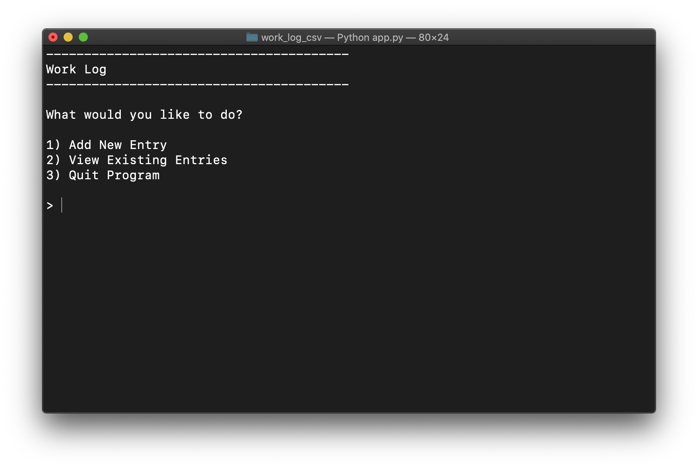
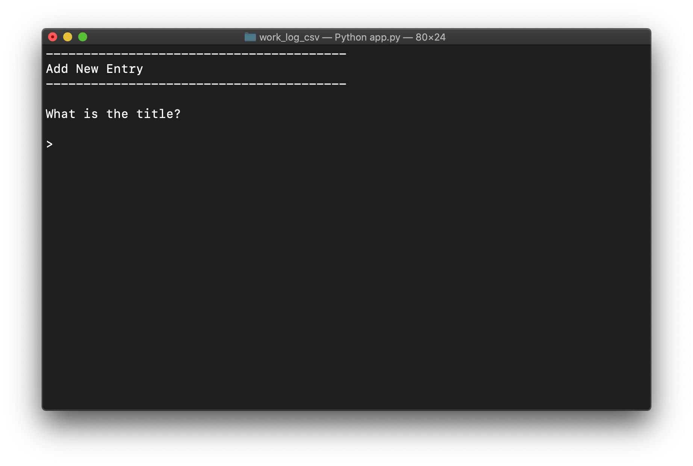
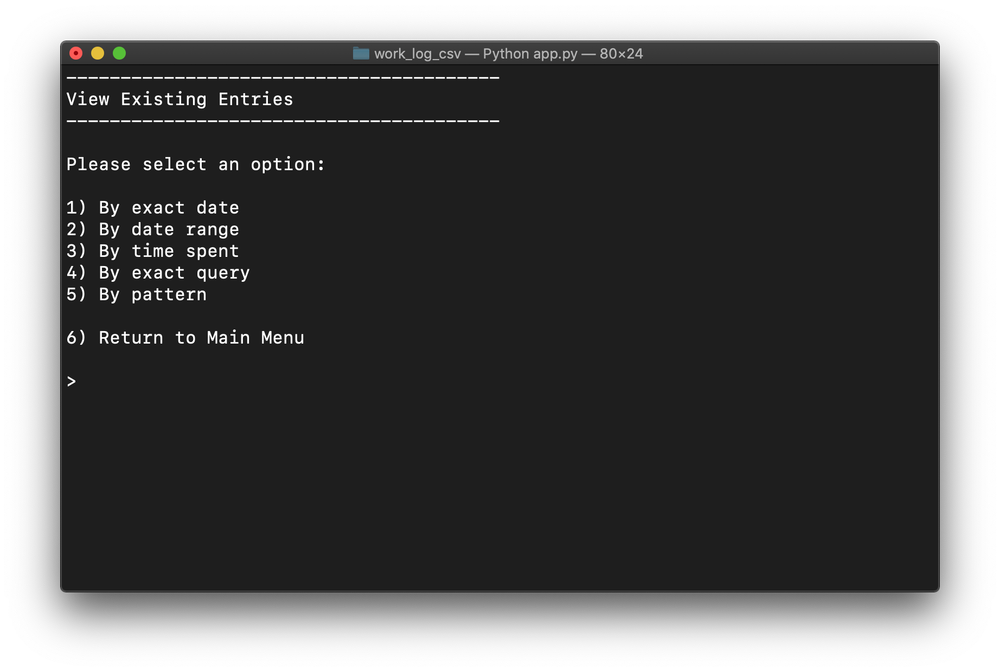
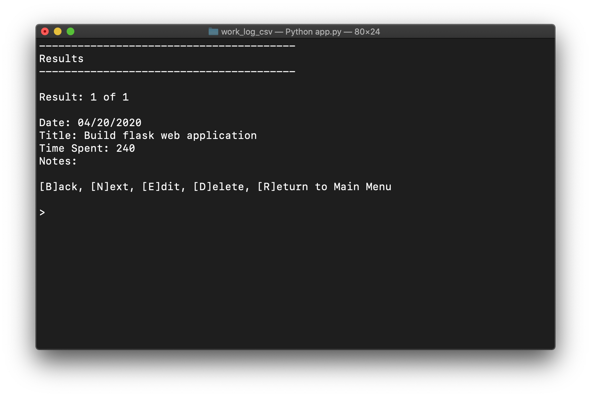

<h1>Work Log CSV</h1>

<h2>1. Description</h2>

To prepare better timesheets for a company, I developed a terminal application for logging what work someone did on a certain day. The script asks for a task name, how much time was spent on the task, and any general notes about the task. The program records each of these items into a row of a CSV file along with a date. I also provided a way for a user to find all of the tasks that were done on a certain date or that match a search string.

<table>
  <tr>
    <th>Main Menu</th>
    <th>Add Entry</th>
  </tr>
  <tr>
    <td></td>
    <td></td>
  </tr>
  <tr>
    <th>View Entries</th>
    <th>Results</th>
  </tr>
  <tr>
    <td></td>
    <td></td>
  </tr>
</table>

<h2>2. Installation</h2>
<ol>
  <li>Download the project</l1>
  <li>Open the terminal and change directory to the project folder</li>
  <li>Type "python3 app.py"</li>
</ol>
